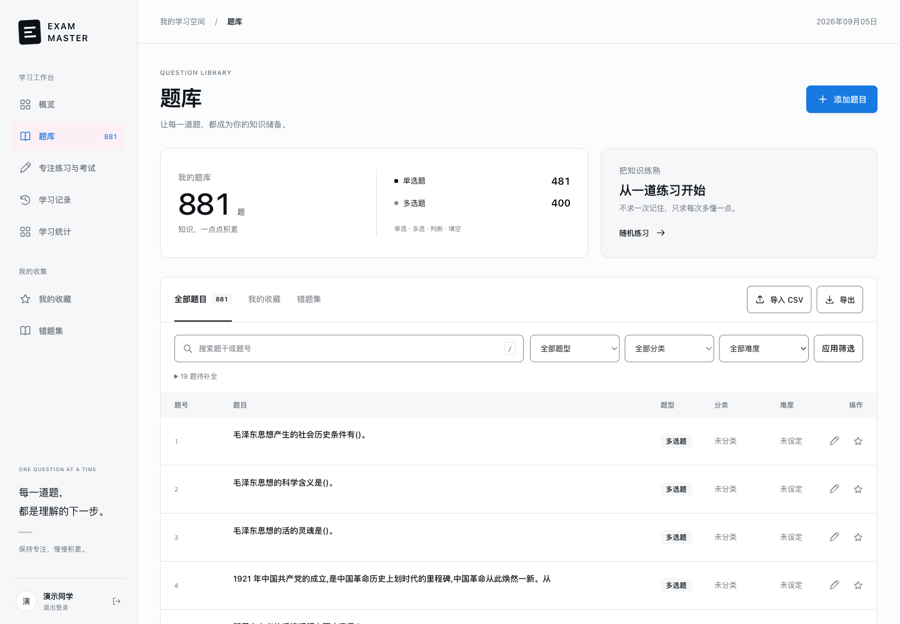
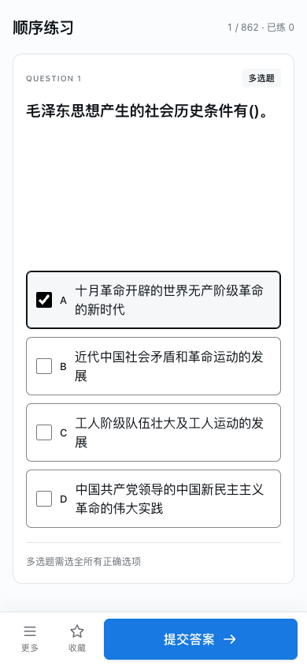
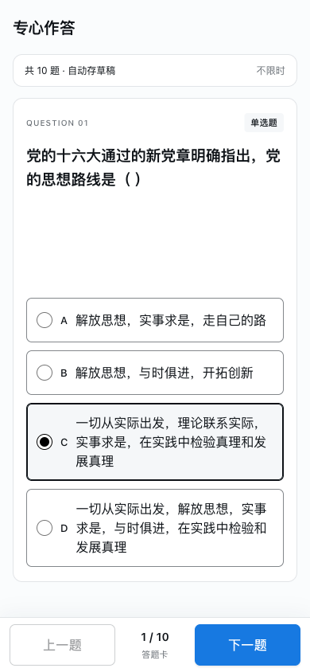
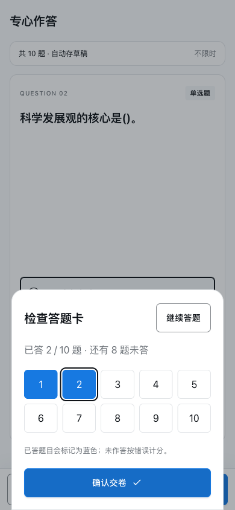
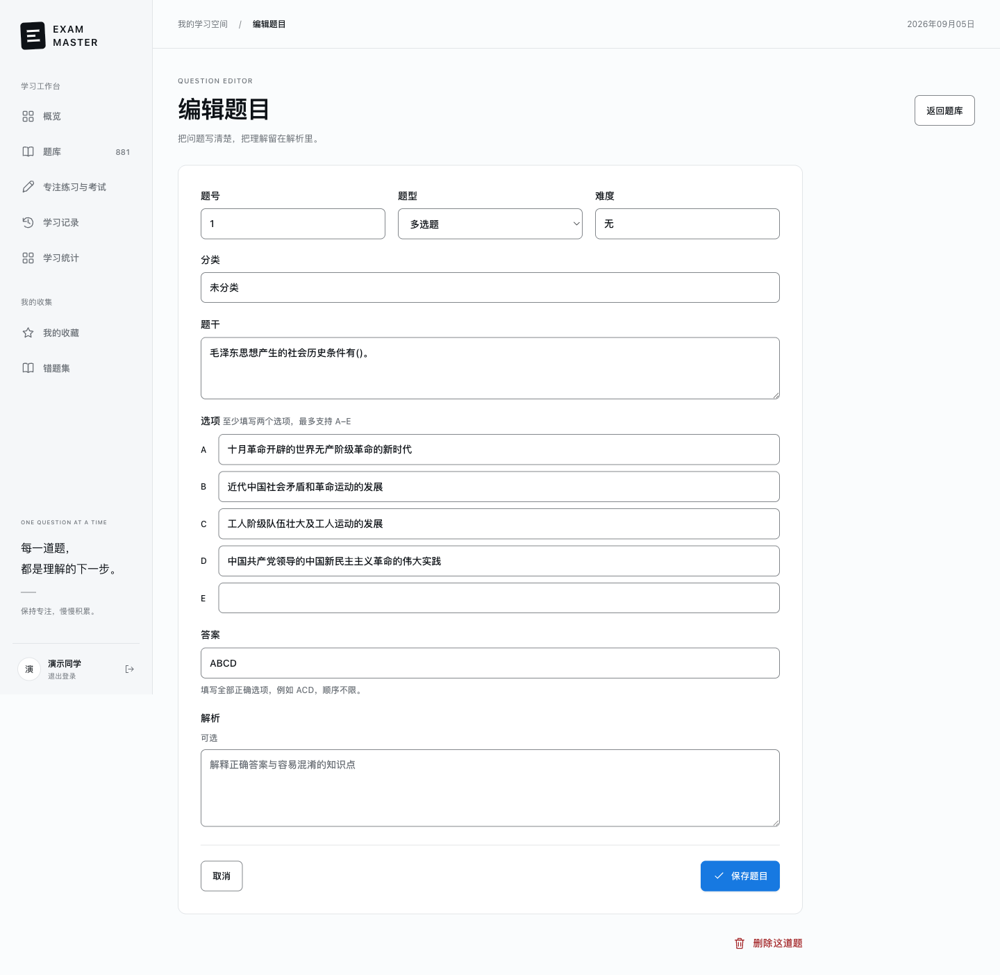

<p align="center">
  
</p>

<h1 align="center">EXAM-MASTER</h1>

<p align="center">一道题，一个更清晰的答案。</p>
<p align="center">轻量的 Python 网页题库 · 专注练习 · 模拟考试 · 手机单手操作</p>

EXAM-MASTER 把题库整理、日常刷题和考前复习放在同一个学习工作台。使用 **Flask + SQLite + Jinja**，页面由服务器直接渲染，搭配原生 CSS 与少量 JavaScript；安装 Python 依赖后即可运行，无前端构建步骤。

## 本次重构

新版围绕“代码更少、题库管理完整、手机操作方便”重新整理了 Web 应用，保留登录、多用户学习记录和原有学习模式。

| 改动 | 现在的体验 |
| --- | --- |
| 精简架构 | 合并搜索、筛选、收藏和错题列表；复用判题、考试与草稿逻辑，后端集中在 `app.py` 和 `db.py`。 |
| 补齐题库管理 | 网页新增、编辑、删除题目，维护分类、难度与解析，上传和导出 CSV。 |
| 重新设计前端 | 基于 Open Design 的冷白、深墨和蓝色视觉，统一题库、练习、考试、记录和登录页面。 |
| 手机单手操作 | 底部导航与展开菜单；短题选项靠近下半屏，收藏、提交和下一题固定在底部。 |
| 手机逐题考试 | 每次显示一道题，底部翻题，展开答题卡检查后交卷；刷新恢复草稿与题序。 |
| 完整学习记录 | 保留随机未答、顺序续答、错题和收藏复习；考试保存题目快照，提交后可以重新查看结果。 |
| 修复旧版问题 | 修正填空判分、限时脚本、筛选续答和历史题号复用等问题，增加功能回归测试。 |

### 代码规模

| 统计范围 | 重构前 | 当前版本 |
| --- | ---: | ---: |
| Python 运行源码 | 1,494 行 | 578 行 |
| Web 运行源码 | 7,624 行 | 1,350 行 |
| Web 源码字节数 | 243,717 | 111,538 |

按源码字节统计，Web 代码减少 **54.2%**。统计于 2026-09-05，以原版提交 `75a45d1` 为基准，包含后端、HTML、CSS 和 JavaScript；不包含测试、文档、图片、题库数据及 Android。当前规模包含本次手机操作适配。

## 界面预览

以下截图来自当前运行中的系统，使用独立演示账号与仓库附带题库。桌面为 1440px 宽，手机为 390 × 844 的浏览器视口；截图中的作答仅用于展示。

### 桌面题库

统一搜索、组合筛选、收藏与 CSV 管理，直接进入题目练习或编辑。



### 手机练习与考试

常见题目尽量一屏完成；长题保留正常字号与滚动空间。主要按钮高 52px，选项触控区域至少 56px，底部留出设备安全区。

<table>
  <tr>
    <th>专注练习</th>
    <th>逐题考试</th>
    <th>检查答题卡</th>
  </tr>
  <tr>
    <td></td>
    <td></td>
    <td></td>
  </tr>
</table>

<details>
<summary>查看桌面题目编辑界面</summary>

题干、选项、答案、分类、难度和解析在同一张表单维护，支持单选、多选、判断与填空。



</details>

## 功能

| 模块 | 支持内容 |
| --- | --- |
| 题库管理 | 新增、编辑、删除；关键词搜索；题型、分类、难度组合筛选；分页；CSV 导入导出。 |
| 日常练习 | 随机未答、顺序续答、错题复习、收藏复习；提交后查看答案与解析；未提交答案保存为浏览器草稿。 |
| 模拟与限时考试 | 自定义题数、分类、题型和时长；答题草稿；到期自动交卷；结果与题目快照持久保存。 |
| 个人学习 | 收藏标签、答题历史、统计与个人记录重置；不同账号的学习记录独立保存。 |

**账号与题库：**当前没有单独的管理员角色。注册并登录后，所有账号都可以管理共享题库；收藏、作答历史、顺序进度和考试记录按账号区分。

**计分方式：**各题等权计分；多选必须选全且不能多选，未作答按错误计分。填空按文字顺序匹配。

## 快速开始

需要 **Python 3.10 或以上**。

```bash
git clone https://github.com/CiE-XinYuChen/EXAM-MASTER.git
cd EXAM-MASTER
python3 -m venv venv
venv/bin/python -m pip install -r requirements.txt
venv/bin/python app.py
```

<details>
<summary>Windows PowerShell 启动方式</summary>

克隆仓库并进入项目目录后运行：

```powershell
python -m venv venv
.\venv\Scripts\python.exe -m pip install -r requirements.txt
.\venv\Scripts\python.exe app.py
```

</details>

打开 **[http://127.0.0.1:32220](http://127.0.0.1:32220)**，创建账号后登录。同一局域网中的手机可以访问 `http://电脑的局域网IP:32220`。

首次启动会创建 `database.db` 并导入 `questions.csv`。已有数据库会增量添加所需字段，保留原有账号和学习数据；清空题库后，重启不会重新导入原始 CSV。

### 配置

通过环境变量覆盖默认配置：

| 变量 | 默认值 | 用途 |
| --- | --- | --- |
| `PORT` | `32220` | 网页监听端口。 |
| `EXAM_DATABASE` | 项目目录下的 `database.db` | SQLite 数据库路径。 |
| `EXAM_SEED_CSV` | 项目目录下的 `questions.csv` | 首次初始化时导入的 CSV；空字符串表示从空题库开始。 |
| `SECRET_KEY` | 本地开发固定值 | Flask 会话签名密钥。 |
| `FLASK_DEBUG` | `0` | 设为 `1` 开启开发调试。 |

例如，在 macOS / Linux 上使用另一个端口：

```bash
PORT=8080 venv/bin/python app.py
```

## 题库与 CSV

仓库附带 **881 道原始题目**，包括 481 道单选和 400 道多选。其中 18 题缺少题干，1 题的答案引用了缺失选项，均保留并标为“待补全”；当前有 862 题可用于练习与组卷。

在网页中补全题目后即可参与练习。新系统也支持自行添加判断题和填空题。

CSV 使用 UTF-8 编码，可带 BOM。必需列为 `题号、题干、答案、题型`，可选列为 `A、B、C、D、E、难度、类别、解析`。导入页面提供模板下载。

```csv
题号,题干,A,B,C,D,E,答案,难度,题型,类别,解析
example-1,Python 文件的扩展名是什么？,.py,.js,,,,A,简单,单选题,编程,Python 源文件通常使用 .py 扩展名。
```

- **导入：**同题号更新，新题号新增；结构或格式错误时整批不写入，内容不完整的题目可作为待补全题导入。
- **导出：**导出当前筛选条件下的全部题目，使用 UTF-8 BOM，便于表格软件打开。
- **答案：**单选如 `B`，多选如 `ACD`，判断使用 `正确` / `错误`，填空填写完整文本。
- **删除：**移除题目及其收藏关联，已有答题记录和考试快照保留；新增题目不会复用这些历史记录中的题号。

## 项目结构

```text
EXAM-MASTER/
├── app.py               # 页面、登录、题库管理、练习、考试与统计
├── db.py                # SQLite、数据初始化、题目格式、判题与 CSV
├── templates/           # Jinja 页面与共享组件
├── static/              # 样式、导航、手机翻题、计时与草稿
├── tests/test_app.py    # 临时 SQLite 功能回归测试
├── docs/assets/         # Logo 与当前系统截图
├── questions.csv        # 原始题库
└── requirements.txt     # Python 运行依赖
```

本轮重构只覆盖网页，`ExamMasterAndroid/` 保留原样。设计来源见 [Open Design 说明](docs/open-design.md)，架构取舍与验证见 [重构说明](docs/superpowers/specs/2026-09-05-web-refactor-design.md)。

## 验证

```bash
venv/bin/python -m unittest discover -s tests -v
```

目前有 **21 项功能回归测试**，覆盖题目管理、CSV 往返与回滚、四种题型、多用户记录、筛选续答、收藏、考试快照、重复提交和旧数据库升级。

浏览器已检查 360、390、430px 手机宽度及桌面布局，走通收藏、草稿恢复、逐题考试与到期自动交卷。手机尺寸模拟通过，iOS / Android 真机的软键盘与握持手感仍需实测。详见 [手机适配记录](docs/superpowers/plans/2026-09-05-mobile-ergonomics.md)。

## Star History

如果这个项目对你有帮助，欢迎在 [GitHub](https://github.com/CiE-XinYuChen/EXAM-MASTER) 点亮一颗 Star。

<a href="https://www.star-history.com/?repos=CiE-XinYuChen%2FEXAM-MASTER&amp;type=date">
  <picture>
    <source media="(prefers-color-scheme: dark)" srcset="https://api.star-history.com/svg?repos=CiE-XinYuChen/EXAM-MASTER&amp;type=Date&amp;theme=dark">
    <source media="(prefers-color-scheme: light)" srcset="https://api.star-history.com/svg?repos=CiE-XinYuChen/EXAM-MASTER&amp;type=Date">
    
  </picture>
</a>

图表由 [Star History](https://www.star-history.com/blog/how-to-use-github-star-history/) 提供，随服务刷新并适配明暗主题；点击图表可查看完整趋势。

## 许可证

[MIT License](LICENSE) · Copyright © 2024 Shayne Chen
